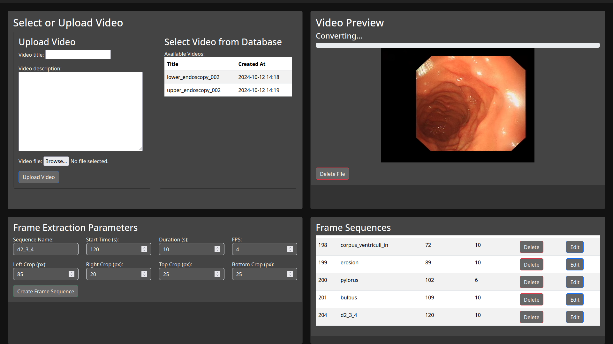

### `README.md` for the Endoscopic Image Annotation Dataset Project

---

# Project: Creating an Annotation Dataset for Endoscopic Images and Training a Neural Network

## Project Overview

The goal of this project is to **create an annotated dataset for images step-by-step** based on endoscopic procedures, such as:  
- **Gastroscopy**  
- **Colonoscopy**  
- **Bronchoscopy**  
- **Endoscopic Ultrasound (EUS)**  

The annotated dataset will be used to **train a neural network** for automatic detection of:  
1. **Anatomical landmarks**  
2. **Pathological findings**  
3. **Quality assessment of the procedure**  

The project aims to support both **offline mode** (post-processing) and **online mode** (real-time analysis).

---

## Project Structure

1. **Image Annotation**:  
   Use an interface to **create and extrapolate masks** across image sequences within a single procedure.

2. **Mask Generation and Extrapolation**:  
   Masks are manually created for a single frame and then **extrapolated to the rest of the frames** in the sequence.

3. **Tags and Mask Management**:  
   Each mask is linked to an **anatomical landmark or pathology** through a corresponding tag, stored in the database, and displayed on the annotated images.

4. **Data Preparation for Model Training**:  
   The final dataset will be used to **train a neural network** for automatic recognition.

---

## Key Features

1. **Mask Generation for Individual Frames**  
   - Users select a specific frame and create a mask by specifying its color and corresponding tag.
   - The mask is saved both in the database and on the disk.

2. **Extrapolation of Masks to All Frames in the Sequence**  
   - An extrapolation model automatically applies annotations across all frames based on the first annotated frame.
   - Masks for all frames are saved on disk and in the database.

3. **Mask Deletion**  
   - Users can delete either a single mask or all masks associated with a specific tag within the sequence.

4. **Mask Display and Management**  
   - Masks are displayed on the images, with options to toggle visibility or delete them.

---

## Installation and Setup

### 1. Install Dependencies
The project requires Python and Django. To install all dependencies, create a virtual environment and install the necessary libraries:

```bash
python3 -m venv venv
source venv/bin/activate  # For Linux/macOS
# For Windows: venv\Scripts\activate

pip install -r requirements.txt
```

### 2. Database Configuration
The project uses **SQLite** by default. You can also configure **PostgreSQL** or other databases in the `settings.py` file. Run the migrations:

```bash
python manage.py migrate
```

### 3. Set Environment Variables
Create a `.env` file to store configuration settings such as `MEDIA_ROOT` and security keys.

Example `.env` file:
```
SECRET_KEY=your_secret_key
DEBUG=True
MEDIA_ROOT=/path/to/media/
MEDIA_URL=/media/
```

### 4. Run the Local Server
To start the application, use the following command:

```bash
python manage.py runserver
```

### 5. Access the Interface
Once the server is running, the interface will be available at:  
```
http://127.0.0.1:8000/
```

---

## API Endpoints

### 1. Generate Mask for a Frame

**URL:** `/generate_mask/`  
**Method:** `POST`  
**Description:** Generates a mask for a selected frame.  

Example Request:
```json
{
    "sequence_id": 1,
    "frame_id": 10,
    "points": [
        {"x": 30, "y": 40, "sign": "+"},
        {"x": 50, "y": 60, "sign": "-"}
    ],
    "tag_id": 2,
    "mask_color": "#FF0000"
}
```

### 2. Extrapolate Masks Across All Frames

**URL:** `/extrapolate_masks/`  
**Method:** `POST`  
**Description:** Extrapolates the mask from the current frame to all frames in the sequence.

Example Request:
```json
{
    "sequence_id": 1,
    "current_frame_id": 10,
    "tag_id": 2,
    "points": [
        {"x": 30, "y": 40, "sign": "+"},
        {"x": 50, "y": 60, "sign": "-"}
    ],
    "mask_color": "#00FF00"
}
```

---

## Database Structure

- **FrameSequence**: Stores information about frames from a single procedure.
- **Mask**: Stores details about masks (file path, color, tag) for each frame.
- **Tag**: Represents anatomical landmarks or pathological findings.
- **Points**: Stores coordinates (x, y) and sign (`+/-`) used to create masks.

---

## Usage Examples

1. **Creating a Mask for a Frame**:
   - Select the desired frame and mark points for annotation.
   - Save the mask and assign it to a specific tag.

2. **Mask Extrapolation**:
   - Create a mask for one frame.
   - Run extrapolation to automatically apply the mask to the entire sequence.

---

## Future Improvements

- **Online Analysis Integration**: Real-time identification of anatomical landmarks during procedures.
- **Model Optimization**: Training and fine-tuning the neural network based on the generated dataset.
- **Support for Additional Data Formats**: Adding support for video files and 3D images.
- **Quality Control Module**: Automated analysis of procedure quality with feedback and recommendations.

---

## Contributing

If you'd like to contribute to the project:
1. Fork the repository.
2. Create a new branch: `git checkout -b feature/medical_segmentation`.
3. Commit your changes: `git commit -m "Add your feature"`.
4. Push to the branch: `git push origin feature/medical_segmentation`.
5. Open a Pull Request.

---

## License

This project is licensed under the **MIT License**.

---

## Contact

If you have any questions or suggestions, feel free to reach out:
- **Email:** ldc.endoscopy@gmail.com  
- **Telegram:** @Hukuma

---

## Conclusion

This project aims to create a high-quality annotated dataset for endoscopic procedures. The data collected will help improve diagnostics and the quality of endoscopic procedures through state-of-the-art AI technologies.