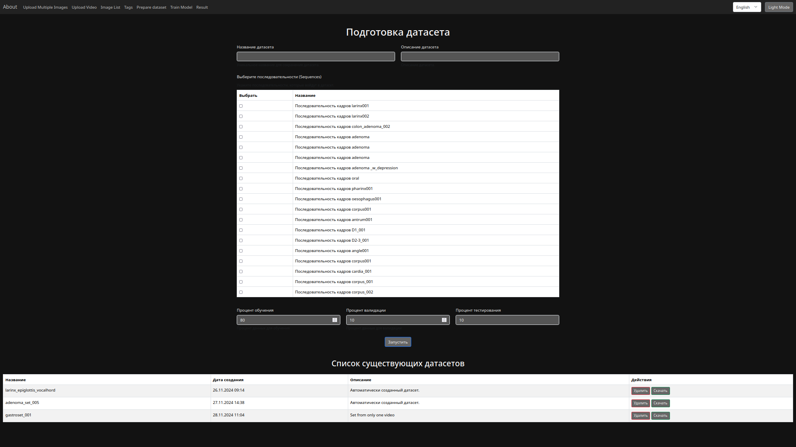

### `README.md` для проекта по созданию датасета эндоскопических исследований

---

# Проект: Создание датасета для разметки эндоскопических исследований и обучение нейронной сети

## Описание проекта

Цель данного проекта — **поэтапное создание датасета с разметкой для изображений**, полученных при проведении эндоскопических исследований, таких как:  
- **Гастроскопия**  
- **Колоноскопия**  
- **Бронхоскопия**  
- **Эхоэндоскопия (EUS)**  

В дальнейшем разметка будет использована для **обучения нейронной сети** с целью автоматического распознавания:  
1. **Анатомических ориентиров**  
2. **Патологических находок**  
3. **Качества проведения исследования**  

Проект рассчитан на работу как в **офлайн-режиме** (последующая обработка данных), так и в **онлайн-режиме** (интерактивный анализ в реальном времени).

---

## Структура проекта

1. **Разметка изображений**:  
   Использование интерфейса для **создания и экстраполяции масок** на серии изображений в рамках одного исследования.
   
2. **Генерация и экстраполяция масок**:  
   Маска создаётся для одного кадра вручную и затем **экстраполируется на все кадры** в последовательности.

3. **Работа с тегами и масками**:  
   Каждая маска привязывается к **анатомическому ориентиру или патологии** через соответствующий тег, сохраняется в базе данных и отображается на изображениях.

4. **Подготовка данных для обучения**:  
   Итоговый датасет будет использоваться для **обучения нейронной сети** для автоматического распознавания.

---

## Основные функции

1. **Генерация масок для конкретного кадра**  
   - Пользователь выбирает нужный кадр и создаёт маску, определяя её цвет и соответствующий тег.
   - Маска сохраняется в базе данных и на диске.

2. **Экстраполяция масок на все кадры последовательности**  
   - Используется модель экстраполяции для автоматической разметки всех кадров на основе разметки первого кадра.
   - Маски для всех кадров автоматически сохраняются на диске и в базе данных.

3. **Удаление масок**  
   - Возможность удаления одной маски или всех масок для выбранного тега в последовательности.

4. **Отображение и управление масками**  
   - Отображение масок на изображениях, возможность включать/выключать маску или удалить её.

---

## Установка и настройка

### 1. Установка зависимостей
Проект использует Python и Django. Для установки всех зависимостей создайте виртуальное окружение и установите нужные библиотеки:

```bash
python3 -m venv venv
source venv/bin/activate  # Для Linux/macOS
# Для Windows: venv\Scripts\activate

pip install -r requirements.txt
```

### 2. Настройка базы данных
В проекте используется **SQLite** (по умолчанию), либо можно настроить PostgreSQL или другую БД в файле `settings.py`. Выполните миграции:

```bash
python manage.py migrate
```
Для заполнения первичных данных используйте команду:

```bash
python manage.py import_tags
```

### 3. Настройка переменных окружения
Создайте файл `.env` для хранения конфигурации, таких как `MEDIA_ROOT`, пути к файлам и ключей безопасности.

Пример `.env`:
```
SECRET_KEY=ваш_секретный_ключ
DEBUG=True
MEDIA_ROOT=/путь/до/папки/media/
MEDIA_URL=/media/
```

### 4. Запуск локального сервера
Для запуска приложения используйте команду:

```bash
python manage.py runserver
```

### 5. Доступ к интерфейсу
После запуска сервера интерфейс будет доступен по адресу:  
```
http://127.0.0.1:8000/
```

---

## API-методы

### 1. Генерация маски для кадра

**URL:** `/generate_mask/`  
**Метод:** `POST`  
**Описание:** Создаёт маску для выбранного кадра.  

Пример запроса:
```json
{
    "sequence_id": 1,
    "frame_id": 10,
    "points": [
        {"x": 30, "y": 40, "sign": "+"},
        {"x": 50, "y": 60, "sign": "-"}
    ],
    "tag_id": 2,
    "mask_color": "#FF0000"
}
```

### 2. Экстраполяция масок на все кадры

**URL:** `/extrapolate_masks/`  
**Метод:** `POST`  
**Описание:** Экстраполирует маску с текущего кадра на все кадры в последовательности.

Пример запроса:
```json
{
    "sequence_id": 1,
    "current_frame_id": 10,
    "tag_id": 2,
    "points": [
        {"x": 30, "y": 40, "sign": "+"},
        {"x": 50, "y": 60, "sign": "-"}
    ],
    "mask_color": "#00FF00"
}
```

---

## Структура базы данных

- **FrameSequence**: Хранит информацию о кадрах для одного исследования.
- **Mask**: Содержит данные о масках (файл, цвет, тег) для каждого кадра.
- **Tag**: Теги, которые указывают на анатомические ориентиры или патологические находки.
- **Points**: Точки, используемые для создания масок (x, y координаты и знак `+/-`).

---

## Примеры использования

1. **Создание маски для кадра**:
   - Выберите нужный кадр и укажите точки для разметки.
   - Сохраните маску и привяжите её к соответствующему тегу.

2. **Экстраполяция масок**:
   - Создайте маску для одного кадра.
   - Запустите экстраполяцию на все кадры в последовательности, чтобы автоматически разметить остальные изображения.

---

## Будущие улучшения

- **Интеграция онлайн-анализа**: Возможность работы в реальном времени для определения анатомических ориентиров во время исследования.
- **Оптимизация модели**: Обучение и дообучение модели на основе созданного датасета.
- **Поддержка других форматов данных**: Добавление поддержки видеофайлов и 3D-изображений.
- **Модуль контроля качества**: Автоматический анализ качества проведения исследования и предоставление рекомендаций.

---

## Вклад в проект

Если вы хотите внести свой вклад в проект:
1. Форкните репозиторий.
2. Создайте новую ветку: `git checkout -b feature/medical_segmentation`.
3. Сделайте коммит: `git commit -m "Add your feature"`.
4. Отправьте изменения: `git push origin feature/medical_segmentation`.
5. Откройте Pull Request.

---

## Лицензия

Этот проект распространяется под лицензией **MIT License**.

---

## Контакты

Если у вас есть вопросы или предложения, свяжитесь с нами:
- **Email:** ldc.endoscopy@gmail.com
- **Telegram:** @Hukuma

---

## Заключение

Этот проект направлен на создание высококачественного датасета с разметкой для эндоскопических исследований. Данные, полученные в рамках проекта, помогут улучшить диагностику и качество проведения исследований с помощью современных методов искусственного интеллекта.